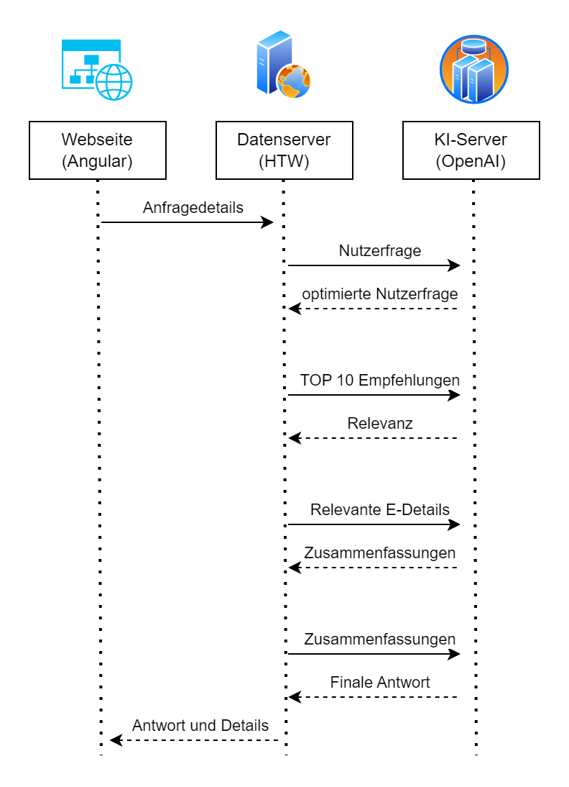
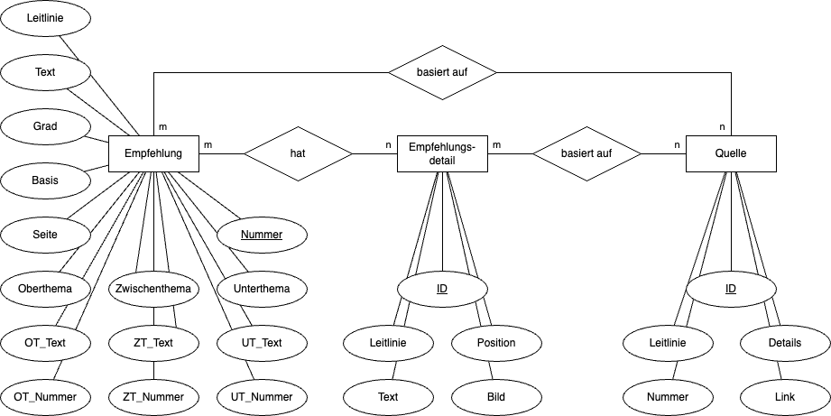

# gaep
Guideline adherent evidence-based physiotherapy

## Table of Contents

- [Introduction](#introduction)
- [Target Group](#target-group)
- [System Overview of the GAEP Application](#system-overview-of-the-gaep-application)
- [Data Flow](#data-flow)
- [Requirements for the GAEP Application](#requirements-for-the-gaep-application)
  - [Hardware Requirements](#hardware-requirements)
  - [Software Requirements](#software-requirements)
  - [Network Requirements](#network-requirements)
- [Data Protection Requirements](#data-protection-requirements)
- [Compliance Requirements](#compliance-requirements)
- [Installation Process and Setup of the GAEP Application](#installation-process-and-setup-of-the-gaep-application)
  - [SQL Database](#sql-database)
  - [Flask Server](#flask-server)
  - [Web Application](#web-application)
- [Security and Data Protection](#security-and-data-protection)
  - [Security Measures](#security-measures)
  - [Data Protection](#data-protection)
  - [Recommendations for Future Developments](#recommendations-for-future-developments)
- [Database Structure](#database-structure)
- [Description of the gaep_server.py Script](#description-of-the-gaep_serverpy-script)
- [Support](#support)

## Introduction

The "GAEP" application (Guideline Adherent Evidence Based Physiotherapy) is an innovative software solution specifically designed to support physiotherapists in the effective use of medical guidelines. Using OpenAI's advanced GPT models, GAEP is able to search and summarize content from different guidelines in a user-specific way. This is done via an interactive question-and-answer dialog system that directly references and succinctly reproduces relevant content from the guidelines.

GAEP is a valuable resource that aims to simplify and improve access to and application of evidence-based practice in physiotherapy, ultimately optimizing patient care.

The application was developed using the angular framework and is available as an open source prototype. The aim of this documentation is to provide a comprehensive overview of the structure and functionality of the application. This includes details on the architecture of the software, instructions for installation and setup as well as information on everyday use.

Although the application was developed in German and only German guidelines are used, we have decided to provide documentation in English.

## Target group

The "GAEP" application is primarily aimed at physiotherapists who wish to use evidence-based methods in their daily practice. Although medical guidelines in Germany are primarily designed for doctors and build an important bridge between science and clinical practice, physiotherapists can also benefit considerably from their content. Guidelines provide a structured framework for physiotherapy treatments and serve as a sound basis for argumentation in discussions with patients.

However, these guidelines are often written in complex technical language that can be difficult to understand without specific medical knowledge. This poses a particular challenge for professionals outside the medical profession. The GAEP application addresses this problem by reducing the complexity of the information and aggregating it in a way that is tailored to specific specialist questions. By using artificial intelligence, not only is the content of the guidelines precisely summarized, but the language is also simplified to a generally understandable level.

## System overview of the GAEP application

1. user interaction: web browser: The user interacts with the GAEP application via a web browser. This provides a user-friendly interface for accessing the application.
2. front end: Website (Angular + web server): The front end of the application runs on a web server and is implemented using the angular framework.This is where the application proecesses user input and provide the user interface
3. backend and data processing:
* FLASK Server (REST API): The Flask Server serves as the backend of the application and provides a REST API. Requests from the GAEP app are received and processed via this API. The Flask Server acts as an intermediary between the database and the application, as well as between the application and external AI services.
* Guideline Database: All relevant data and information from medical guidelines is stored here. The Flask Server accesses this database to answer specific queries or provide data for processing.
4. integration of artificial intelligence: GPT-4 (OpenAI API): The application uses GPT-4, an advanced paid model from OpenAI, to analyze and summarize the content of medical guidelines on a user-specific basis. The Flask server sends requests to the OpenAI API, receives responses and forwards them back to the frontend to be displayed to the user.

## Data flow
............................
Responses from the OpenAI API are received and processed by the Flask Server before being sent back to the frontend to display the requested information to the user.

## Requirements for the GAEP application

### Hardware requirements

**User devices**

* Compatibility: The application is optimized for use on laptops and tablets. It also works on current smartphones, although the user interface is primarily designed for larger screens (tablets, laptops).
* Minimum requirements: Specific minimum hardware requirements have not been identified, however the application has been successfully tested on approximately 4 year old Android tablets and current smartphones and laptops with no performance issues.

**Server hardware**

*Virtualized environment* 
The operation of Flask Server and SQL database was successfully tested on virtual servers with the following minimum specifications:
* Processor: two cores
* RAM: 16 GB RAM

### Software requirements

**Operating systems**

* Client devices: The end-user web application is compatible with the operating systems that support the browsers listed below.
* Development Environment: 
    * Docker Installation (docker compose used)

**Web browser**

The web application has been tested and is compatible with:
* Firefox
* Microsoft Edge

**Server software**

The software required to run the Flask server and the SQL database is specified in a requirements.txt file, which lists all required Python libraries and other dependencies. The application was developed with Python 3.9.2.

### Network requirements

**Internet speed**

* An internet connection that allows the transfer of JSON files of up to 2 MB in a few seconds is recommended.

**Network configuration**

Firewall settings: The following releases are required:
* Access to OpenAI server
* Access to Web server ...............................
* Port sharing for the Flask server on port 5001

## Data protection requirements

Processing of medical data: The GAEP application must not process any personal data. This specifically excludes patient data and other sensitive information to ensure data privacy.

## Compliance requirements:

GDPR (General Data Protection Regulation): The application must fulfill the requirements of the European General Data Protection Regulation. This includes compliance with data protection principles such as data minimization, purpose limitation and transparency.

## Installation process and setup of the GAEP application
The installation process of the GAEP application includes the setup of the SQL database, the Flask server and the web application. Here are the detailed steps for correct installation and configuration:

### SQL database

**Set up the database**

* Set up your own SQL database on a suitable server.
* Make sure that the database server configuration meets the requirements of your infrastructure.

**Initialize database**

* Download the guidelines.sql file from the repository.
* Execute the SQL script to populate the database with the necessary structures and data.

### Flask Server

**Install prerequisites**

* Install Python 3.9.2 and the required packages as listed in the requirements.txt file of the repository.
* Download the file Empfehlung_Kreuzschmerz_COPD.xlsx and upload it to the server.
* Download the file GAEP_Server.py and upload it to the same directory on the server (alternatively, adjust the path to the xlsx file manually).
* Download the file prompt_helper.py and upload it to the same directory on the server (alternatively, adjust the path to the xlsx file manually).
  
**Configuration**

* Configure the access data for the SQL database in the gaep_server.py file.
* Store the access data for the OpenAI API in gaep_server.py as well.
* Define the user data for access to the Flask server in gaep_server.py.
* If necessary, manually adjust the path to the xlsx file in gaep_server.py.
Configure **OpenAI models**
If necessary, select the specific OpenAI models (e.g. Embedding Model, Completion Model) and update them in gaep_server.py if required.

### Web application

...................................................

## Security and data protection

### Security measures

**Password encryption**

Communication with the Flask server is carried out using password encryption. This helps to ensure the security of the transmitted data.
Prototype status: The current development status of the GAEP application is defined as a prototype. Additional security measures should be considered before productive use.

**Suitability of the Flask server** 

The Flask Server used in its standard configuration is not intended for use in a production environment. For production use, more robust and security-oriented server solutions or additional security layers should be considered.

### Data protection

The protection and use of user data in the GAEP application is governed by the following measures:

**Data segregation** 
....................................

**Disclaimer**

When accessing the application, users are informed that the processing of personal data with the application is not permitted.

**Restricted data protection measures** 

Apart from the above-mentioned data separation and the disclaimer, no other specific data protection measures have been implemented. Given the sensitivity of medical data, it is recommended to develop and implement additional data protection strategies, especially with regard to compliance with the General Data Protection Regulation (GDPR) and other relevant data protection regulations.

### Recommendations for future developments

To improve the security and privacy of the GAEP application, the following measures should be considered:

**Implementation of additional security measures** 

These could include: Use of HTTPS to encrypt all data transmissions, more robust authentication and authorization mechanisms, and regular security audits.

**Adapting to production standards** 

Revision of the server configuration and possible migration to a platform that is better suited for production use.

**Data protection compliance** 

Further development of data protection practices to ensure that all personal data is handled in compliance with local and international data protection laws.

## Database structure

The GAEP application uses a structured SQL database to store and manage medical guidelines and related recommendations. The database schema, as shown in the diagram provided, contains multiple tables and relationships that allow for detailed and organized storage of data. As mentioned above the development happened in german language therefore some artifacts are still in german - like table and feature names. Here is a description of the main components of this schema:

**Table "Empfehlung" (engl. Recommendation)**
* ID: Unique identification number.
* Text: The full text of the recommendation.
* Grad: Indicates the grade of the recommendation.
* Basis: Basis or foundation of the guideline.
* Seite (engl. Page): The specific page in the document to which the information refers.
* Nummer (engl. Number): The number of the recommendation within the guideline.
* Oberthema (engl. Main topic): The main topic of the recommendation, e.g. drug intervention.
* Zwischenthema (engl. Intermediate topic): second topic level
* Unterhema (engl. Sub-topic): third topic level
* OT_Text, ZT_Text, UT_Text: Text sections for top topic, intermediate topic and subtopic.
* OT_Nummer, ZT_Nummer, UT_Nummer (engl. OT_Number, ZT_Number, UT_Number): Numerical identifiers for the topics.

The recommendation table links specific recommendations to the respective topics and provides both numerical and text-based descriptions.

**Table "Empfehlungsdetail" (engl. detail)**

* ID: Unique identification number.
* Leitlinie (engl. Guideline): Reference to the guideline to which the detail belongs.
* Position: The specific position of the detail within the guideline.
* Text: Detailed description of the recommendation detail.
* Bild (engl. Image): Images or graphical representations associated with the recommendation base64 coded.

The Recommendation Detail table stores detailed information on specific aspects of a recommendation and also contains visual materials to support the text-based content.

**Table "quelle" (engl. source)**

* ID: Unique identification number.
* Leitlinie (engl. Guideline): Reference to the guideline.
* Number: The number or identifier of the source within the guideline.
* Details: Textual or other details about the source.
* Link: A web link to the source.

The source table provides information that verifies the origin and basis of the information contained in the guidelines.

**Links between the tables**

The relationships between the tables are defined by foreign keys that allow integrated and consistent navigation through the data. This structure efficiently supports the retrieval of data based on thematic or content links and ensures data integrity across the entire schema.

## Description of the gaep_server.py script

The gaep_server.py script serves as a backend server for the GAEP application. The script uses Flask as a web framework to provide a REST API and integrates various technologies and libraries for data processing and searching.

**Main functions of the script**

* OpenAI integration: Uses the GPT-4 model for text analysis and optimization.
* HTTP basic authentication: Secures access to the API via basic authentication.
* Vector database: Uses chromadb to store and efficiently search the recommendation texts.
* Database management: Establishes connections to the SQL database and handles errors.
* Data processing: Defines several functions for analyzing, classifying, optimizing and summarizing user requests and document content.

**Detailed description of the main components**

* Logging and output redirection: the script configures logging so that all standard output is redirected to a log file. The log file is created at server startup based on the current date.
* Database setup: A vector database is created by loading recommendation text and associated metadata from an Excel file and feeding it into chromadb.
* HTTP API: The Flask framework is used to provide endpoints. Authentication is handled via HTTPBasicAuth, with username and password set by environment variables.
* Error handling and database reconfiguration: In the event of connection problems to the SQL database, the script attempts to re-establish the connection automatically.
* Search and response logic: The script provides functions to optimize queries, search the database for relevant content, classify and analyze the results, and finally return a summarized response based on the queries.
* Complex data processing: User queries are processed and optimized using LangChain technology and OpenAI models. The results are classified and summarized to provide accurate and relevant information to end users.

## Support

Questions about the application should be answered within this repository.

