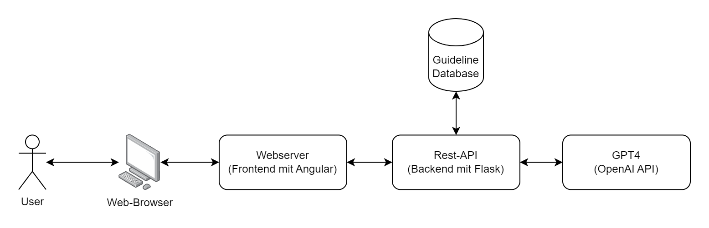

# GAEP
The "GAEP" application (Guideline Adherent Evidence Based Physiotherapy) is an innovative open-source software designed to assist physiotherapists in using medical guidelines effectively. It leverages OpenAI's GPT models to provide user-specific summaries of guideline content via an interactive Q&A system. Developed with the Angular framework, GAEP simplifies the application of evidence-based practices in physiotherapy, aiming to enhance patient care. Although initially developed using German guidelines, the documentation is provided in English to ensure broader accessibility.

[Find a detailed documentation of the software here.](Documentation.md)

**ToDos:**
- Set up and test Backend
- responsive Layout

## Table of Content
- [System Overview](#system-overview)
- [Project structure](#project-structure)
- [Prerequisite](#prerequisite)
- [Installation and setup](#installation-process-and-setup-of-the-gaep-application)
  - [Frontend (Web Applikation)](#frontend-web-application)
  - [Backend (Flask server)](#backend-flask-server)
  - [SQL database](#sql-database)
- [Usage](#usage)
- [License](#license)

## System Overview
The GAEP application consists of a web application, a REST backend, and a database. The web application provides the user with a graphical interface. The backend processes data requests and acts as an intermediary between the database and external AI services. Additionally, GPT-4 from OpenAI is used to analyze and summarize medical guidelines. The guideline database stores all relevant data and information from medical guidelines.



## Project structure
```plaintext
GAEP/
├─ README.md
├─ Documentation.md
├─ Backend/
|  ├─ README.md
|  ├─ dockerfile
|  ├─ docker-compose.yml
|  └─ ....
└─ Frontend/
   ├─ README.md
   ├─ dockerfile
   ├─ dockerfile_prod
   ├─ docker-compose.yml
   └─ app/GAEP
```

The project structure is designed to enhance ease of installation and ensure operating system independence by running components in separate Docker containers. The repository is organized into two main folders: `Frontend` and `Backend`, each containing its own `README.md` file with a relevant documentation. Both components operate independently within their own Docker containers. Additionally, comprehensive documentation about the basic application is available in `Documentation.md`, providing further insights into the project's setup and functionality.


In the following you can get an Overview of the different documentations relating to the component:
```plaintext
GAEP/
├─ README.md                            - overview and setup
├─ Documentation.md                     - detailed documentation
├─ Backend/
|  ├─ README.md                         - backend documentation
└─ Frontend/
   ├─ README.md                         - frontend documentation
   └─ app/GAEP/src/app/
      └─ services/README.md             - frontend: backend service
      └─ models/README.md               - 
      └─ components/tutorial/README.md  - 

```

- [GAEP: overview and setup](/README.md)
- [GAEP: detailed documentation](/Documentation.md)
- [backend documentation](/Backend/README.md)
- [frontend documentation](/Frontend/README.md)
- [frontend: backend service](/Frontend/app/GAEP/src/app/services/README.md) - documentation about
- [frontend: data models](/Frontend/app/GAEP/src/app/models/README.md)
- [frontend: how to make the frontend tutorial](/Frontend/app/GAEP/src/app/components/tutorial/README.md)


## Prerequisite
To run the GAEP software system, you need the following software installed:
- Docker (Docker Compose) (tested with version 20.10.25)

You can use your web browser to access the application. The following browsers have been tested:
- Firefox
- Microsoft Edge

## Setup
To set up the GAEP software system, you will need to run the following 3 components: Frontend, Backend and Database. Below is the description of how to run them.

### Frontend (Web application)
The front-end, or web application, runs in a Docker container. To deploy the frontend for a production environment, navigate to the `Frontend` folder. Than build and run the corresponding container using:
> docker compose build gaep-frontend-prod
> docker compose up gaep-frontend-prod

[Find detailed documentation here](Frontend/README.md)

### Backend (Flask server)
The REST API, implemented using Python (Flask), runs inside a Docker container. To run the backend, first navigate to the `Backend` directory where the backend resides and launch the Docker container:
> docker compose up


  
**Configuration**

* Configure the access data for the SQL database in the gaep_server.py file.
* Store the access data for the OpenAI API in gaep_server.py as well.
* Define the user data for access to the Flask server in gaep_server.py.
* If necessary, manually adjust the path to the xlsx file in gaep_server.py.
Configure **OpenAI models**
If necessary, select the specific OpenAI models (e.g. Embedding Model, Completion Model) and update them in gaep_server.py if required.


[Find detailed documentation here](Backend/README.md)


### SQL database

**Set up the database**

* Set up your own SQL database on a suitable server.
* Make sure that the database server configuration meets the requirements of your infrastructure.

**Initialize database**

* Download the guidelines.sql file from the repository.
* Execute the SQL script to populate the database with the necessary structures and data.

You can find more information about the database model in the extended documentation [here](/Documentation.md#database-structure)

## License
This project is licensed under the MIT License.